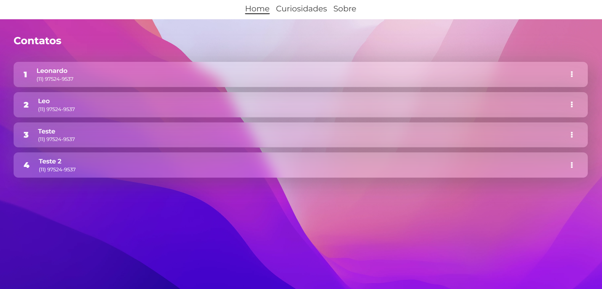

# API / Front-End
### `Front-End` usando Fake API (json-server) com Node.js.
 
  
## Contribuições

Contribuições são bem-vindas! Se você encontrar problemas ou tiver sugestões de melhorias, sinta-se à vontade para abrir um Issues ou enviar um Pull request.

## Contato

Se você tiver alguma dúvida ou feedback, sinta-se à vontade para entrar em contato em [leopansonato@gmail.com](mailto:leopansonato@gmail.com).

## Screenshot

